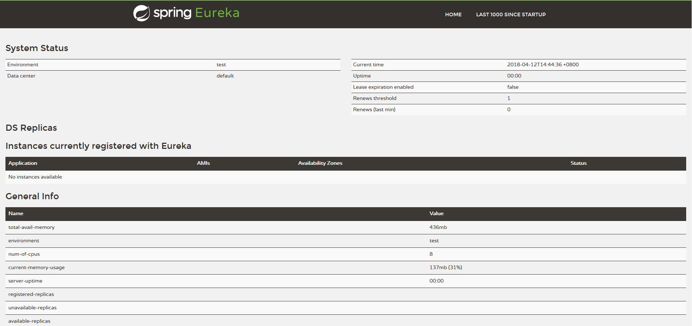

**服务注册中心示例**

**Spring Cloud Eureka**

使用**Netflix Eureka**来实现服务注册与发现,它既包含了服务端组件也包含了客户端组件。

**搭建服务注册中心**

**一、创建spring boot工程**

    命名为springcloud-eureka-server，并在pom.xml文件中引入依赖，代码如下,详细的内容请查看源文件：
```java
               <dependency>
			<groupId>org.springframework.cloud</groupId>
			<artifactId>spring-cloud-starter-eureka-server</artifactId>
		</dependency>
		<dependency>
			<groupId>org.springframework.boot</groupId>
			<artifactId>spring-boot-starter-test</artifactId>
			<scope>test</scope>
		</dependency>
```
    
**二、修改配置文件application.properties,添加如下内容:**
```java
server.port=8761
eureka.instance.hostname=localhost
eureka.client.register-with-eureka=false
eureka.client.fetch-registry=false
eureka.client.service-url.defaultZone=http://${eureka.instance.hostname}:${server.port}/discovery/eureka/
```
* eureka.client.register-with-eureka属性:代表的含义是本应用是否向注册中心注册自己
* eureka.client.fetch-registry属性:代表的含义是本应用是否需要去检索服务


**三、修改启动类**
```java
package com.chit.cloud;

import org.springframework.boot.SpringApplication;
import org.springframework.boot.autoconfigure.SpringBootApplication;
import org.springframework.cloud.netflix.eureka.server.EnableEurekaServer;

@EnableEurekaServer
@SpringBootApplication
public class SpringcloudEurekaServerApplication {

	public static void main(String[] args) {
		SpringApplication.run(SpringcloudEurekaServerApplication.class, args);
	}
}

```
在完成上述配置后，启动应用并访问http://localhost:8761/,即可看到Eureka的信息面板。

至此一个单节点的注册中心就产生了。
