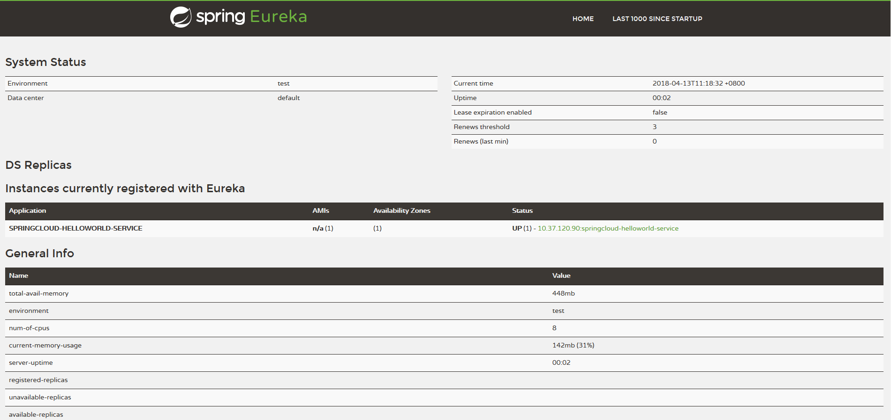

**服务提供者示例**
---
**搭建服务提供者**
---
**一、创建spring boot工程**

命名为springcloud-helloworld-service，并在pom.xml中引入依赖，代码如下，详细的内容请查看源文件：
```xml
<dependency>
      <groupId>org.springframework.cloud</groupId>
      <artifactId>spring-cloud-starter-eureka</artifactId>
    </dependency>
    <dependency>
      <groupId>org.springframework.boot</groupId>
      <artifactId>spring-boot-starter-web</artifactId>
    </dependency>
    <dependency>
      <groupId>org.springframework.boot</groupId>
      <artifactId>spring-boot-starter-test</artifactId>
      <scope>test</scope>
    </dependency>
```
---
**二、修改配置文件application.properties,添加如下内容:**
```java
spring.application.name=springcloud-helloworld-service
eureka.client.serviceUrl.defaultZone=http://localhost:8761/discovery/eureka/
```
---
**三、编写服务方法**
HelloWorldController.java
```java
@Autowired
    private DiscoveryClient discoveryClient;

    @RequestMapping(value = "/helloworld",method = RequestMethod.GET)
    public String index(){
        ServiceInstance instance = discoveryClient.getLocalServiceInstance();
        logger.info("/helloworld,host:" + instance.getHost() + ", service_id:" + instance.getServiceId());
        return "helloworld";
    }
```

通过注入DiscoveryClient对象，在日志中打印出服务的相关内容。

---
**四、修改启动类**
```java
package com.chit.cloud;

import org.springframework.boot.SpringApplication;
import org.springframework.boot.autoconfigure.SpringBootApplication;
import org.springframework.cloud.client.discovery.EnableDiscoveryClient;

@EnableDiscoveryClient
@SpringBootApplication
public class App 
{
    public static void main( String[] args )
    {
        SpringApplication.run(App.class,args);
    }
}

```
---
**五、验证服务提供者**

在完成上述配置后，先启动服务注册中心springcloud-eureka-server，然后再启动服务提供者springcloud-helloworld-service。
效果如下：



