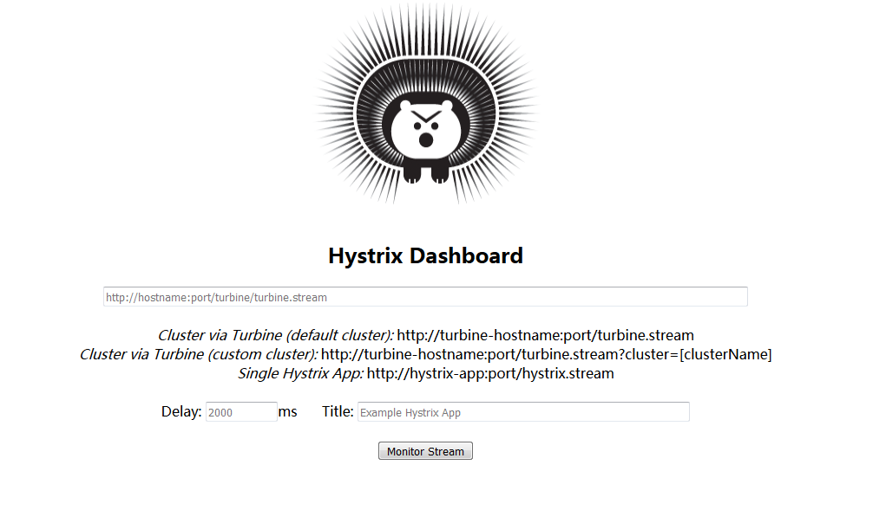
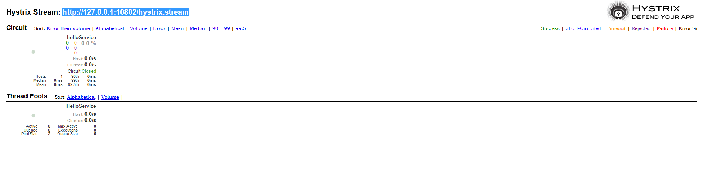

# **Hystrix-Dashboard**

---

**Hystrix-Dashboard示例:springcloud-hystrix-dashboard**

---

##如何构建Hystrix Dashboard服务来对springcloud-hystix-consumer服务进行监控？

## 一、构建一个Hystrix Dashboard服务springcloud-hystrix-dashboard
###1、创建一个springboot工程，命名为springcloud-hystrix-dashboard。
###2、编辑pom.xml,具体依赖内容如下
```xml
<dependencies>
		<dependency>
			<groupId>org.springframework.cloud</groupId>
			<artifactId>spring-cloud-starter-hystrix</artifactId>
		</dependency>
		<dependency>
			<groupId>org.springframework.cloud</groupId>
			<artifactId>spring-cloud-starter-hystrix-dashboard</artifactId>
		</dependency>
		<dependency>
			<groupId>org.springframework.boot</groupId>
			<artifactId>spring-boot-starter-actuator</artifactId>
		</dependency>
	</dependencies>
```

引入spring-cloud-starter-hystrix-dashboard依赖包。
###3、为应用主类加上@EnableHystrixDashboard，启用Hystrix Dashboard功能。
###4、根据实际情况修改application.properties配置文件
```cfml
spring.application.name=hystrix-dashboard
server.port=2001
```
到这里已经完成了基本配置，接下来可以启动该应用了。并且访问http://127.0.0.1:2001/hystrix 可以看到如下页面。



---

##二、对springcloud-hystix-consumer服务进行监控

在hystrix Dashboard的监控首页中，显示出Hystrix Dashboard共支持三种不同的监控方式。如下：
- [x] Cluster via Turbine (default cluster): http://turbine-hostname:port/turbine.stream 
默认集群监控：通过 URL http://turbine-hostname:port/turbine.stream 开启，实现对默认集群的监控。
- [x] Cluster via Turbine (custom cluster): http://turbine-hostname:port/turbine.stream?cluster=[clusterName] 
指定集群监控：通过 URL http://turbine-hostname:port/turbine.stream?cluster=[clusterName]开启，实现对clusterName集群的监控。
- [x] Single Hystrix App: http://hystrix-app:port/hystrix.stream 
单个应用监控：通过 URL   http://hystrix-app:port/hystrix.stream 开启，实现对单个服务实例进行监控。

### 实例：对服务springcloud-hystrix-consumer服务进行监控

在监控首页中输入连接 http://127.0.0.1:10802/hystrix.stream 点击Monitor Stream按钮。展示监控结果



---
