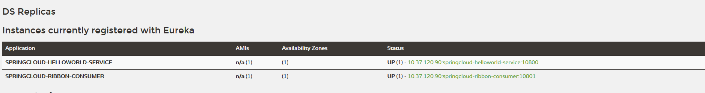

**服务消费者示例**
---
**搭建服务消费者**
---
**一、创建spring boot工程**

命名为springcloud-ribbon-consumer，并在pom.xml中引入依赖，代码如下，详细的内容请查看源文件：
```xml
    <dependencies>
		<dependency>
			<groupId>org.springframework.boot</groupId>
			<artifactId>spring-boot-starter-web</artifactId>
		</dependency>
		<dependency>
			<groupId>org.springframework.cloud</groupId>
			<artifactId>spring-cloud-starter-eureka</artifactId>
		</dependency>
		<dependency>
			<groupId>org.springframework.cloud</groupId>
			<artifactId>spring-cloud-starter-ribbon</artifactId>
		</dependency>

		<dependency>
			<groupId>org.springframework.boot</groupId>
			<artifactId>spring-boot-starter-test</artifactId>
			<scope>test</scope>
		</dependency>
	</dependencies>
```
---
**二、创建应用程序主类**
```java
package com.chit.cloud;

import org.springframework.boot.SpringApplication;
import org.springframework.boot.autoconfigure.SpringBootApplication;
import org.springframework.cloud.client.discovery.EnableDiscoveryClient;
import org.springframework.cloud.client.loadbalancer.LoadBalanced;
import org.springframework.context.annotation.Bean;
import org.springframework.web.client.RestTemplate;

@EnableDiscoveryClient
@SpringBootApplication
public class RibbonConsumerApplication {

	@Bean
	@LoadBalanced
	RestTemplate restTemplate(){
		return new RestTemplate();
	}

	public static void main(String[] args) {
		SpringApplication.run(RibbonConsumerApplication.class, args);
	}
}

```
通过@EnableDiscoveryClient注解让该应用注册为Eureka客户端应用，以获得服务发现的能力。同时创建RestTemplate的Spring Bean实例，并且通过@LoadBalanced注解开启客户端负载均衡。

---
**三、在配置文件中配置属性**

在application.properties中配置Eureka服务注册中心的位置，需要与之前的springcloud-helloworld-service一样，不然是发现不了该服务的。同时设置消费者服务的端口，不能与之前的服务端口冲突，如果是部署在同一个服务器上的话。
```cfml
server.port=10801
spring.application.name=springcloud-ribbon-consumer
eureka.client.service-url.defaultZone=http://localhost:8761/discovery/eureka/
```
---
**四、启动验证**

启动springcloud-ribbon-consumer应用后，我们可以在Eureka信息面板中看到，除了springcloud-helloworld-service之外，还多了我们实现的springcloud-ribbon-consumer服务。


---
接着访问 http://localhost:10801/ribbon-consumer 进行验证。返回helloworld数据内容。