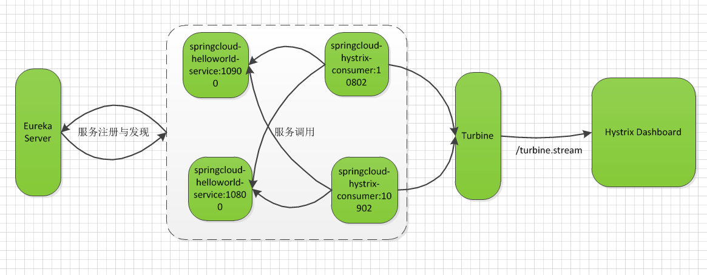
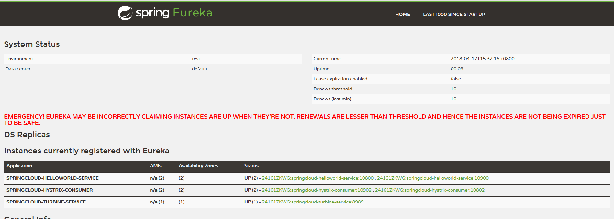
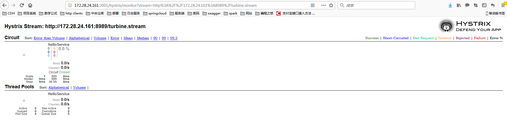

#Turbine集群监控

---

Turbine的功能：通过引入Turbine来聚合springcloud-hystrix-consumer服务的监控信息，并输出给Hystrix Dashboard来进行展示，最好完成的内容如下。

---

搭建的监控服务结构如下图：



---
具体的实现步骤如下：
###一、创建spring boot项目，命名为springcloud-turbine-service。

二、编辑pom.xml,具体依赖内容如下：

```xml
	<dependencies>
		<dependency>
			<groupId>org.springframework.cloud</groupId>
			<artifactId>spring-cloud-starter-turbine</artifactId>
		</dependency>
		<dependency>
			<groupId>org.springframework.boot</groupId>
			<artifactId>spring-boot-starter-actuator</artifactId>
		</dependency>
	</dependencies>
```

三、创建应用主类SpringcloudTurbineServiceApplication.class

```java
package com.cloud.turbine;

import org.springframework.boot.SpringApplication;
import org.springframework.boot.autoconfigure.SpringBootApplication;
import org.springframework.cloud.client.discovery.EnableDiscoveryClient;
import org.springframework.cloud.netflix.turbine.EnableTurbine;

@EnableTurbine
@EnableDiscoveryClient
@SpringBootApplication
public class SpringcloudTurbineServiceApplication {

	public static void main(String[] args) {
		SpringApplication.run(SpringcloudTurbineServiceApplication.class, args);
	}
}

```

编辑application.properties配置

```cfml
spring.application.name=springcloud-turbine-service

server.port=8989
management.port=8990

eureka.client.service-url.defaultZone=http://127.0.0.1:8761/discovery/eureka/
#参数指定了需要收集监控信息的服务名称
turbine.app-config=SPRINGCLOUD-HYSTRIX-CONSUMER
#参数指定了集群名称为default
turbine.cluster-name-expression="default"
#让同一主机上的服务通过主机名与端口号的组合来进行区分，默认情况下会以host来区分不同的服务
turbine.combine-host-port=true

eureka.instance.prefer-ip-address=true
```

---

完成上面的配置后启动如下服务：
springcloud-eureka-server、springcloud-helloworld-service、springcloud-hystrix-consumer、springcloud-turbine-service、springcloud-hystrix-dashboard。
运行结果：



---
turbine.stream展示



---

各服务版本：
v1.0.0